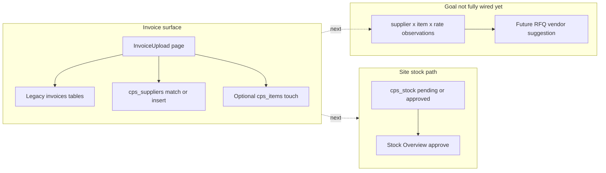

# Invoice-led site stock + vendor enrichment

**Overview:** Align on a **local-first, human-reviewed** workflow: derive site context from invoice text (project name / ship-to / site address), propose per-project `cps_stock` rows in **pending** state, route review through Stock Overview/design as today, then layer in CPS catalog + supplier linkage for future vendor suggestions—without pretending BOQ replaces invoices.

## Todo checklist (manual)

1. **Phase 0 — batch spec**: Freeze extractor fields (`ship_to` / site text, `vendor_gstin`, line items) + rule for assigning `project_code`.
2. **Phase 0 — stock inserts**: SQL/scripts to INSERT `cps_stock` with `approval_status = pending`, `stock_origin = invoice_import`, `invoice_note`.
3. **Phase 1 — supplier policy**: Staged vs active new vendors; align `InvoiceUpload.tsx` with governance.
4. **Phase 1 — item-rate store**: Extend `cps_benchmarks` or add observation table (`supplier × item × rate × invoice ref × date`).
5. **Phase 2 — productize**: In-app wizard when data quality proves out; defer RFQ vendor scoring until Phase 0–1 are solid.

---

## What we confirmed

- **Source of truth for “what exists on site”** moves from vague site lists / BOQ to **actual invoices**.
- **Site identity**: find **project name / site address inside the invoice** (ship-to / consignee / headers)—then procurement/design uses **existing stock dashboards** (`SiteStock.tsx`, `StockOverview.tsx`) to **approve** staged lines.
- **Future goal**: enrich **`cps_items`** and **supplier–item knowledge** so RFQs can ultimately **suggest vendors** from historical rates.

Keeping work **local** first matches iterating on ingestion + mappings without requiring BOQ to succeed first.

---

## Reuse vs new files (relationship to BOQ)

**Maximise reuse of existing CPS UI and tables—do not funnel invoices through the BOQ subsystem.**

| Layer | Reuse as-is / extend lightly | Not the primary invoice path |
|--------|-------------------------------|-------------------------------|
| Stock on site | `cps_stock` + pending/approve in `SiteStock.tsx`, `StockOverview.tsx`; dashboard BOQ vs **approved** stock in `Dashboard.tsx` | *(New pages optional later.)* |
| Invoice ingestion (today) | `InvoiceUpload.tsx`, `invoice-parser` / `invoice-uploader` — GSTIN ↔ `cps_suppliers`, legacy `invoices`. Glue to **`cps_stock`** is additive (script or wizard)—not duplicate BOQ. | — |
| BOQ / BOM | `ProjectBOQ.tsx`, BOQ/BOM tables for **parallel** planning workflows. **Invoice lines do not need BOQ rows first.** | Forcing invoices → BOM → stock adds friction we avoid. |

**Net new artefacts (minimal):**

- **Phase 0:** Conversation + `.sql`/scripts (optionally under `docs/` or `scripts/`).
- **Phase 1:** Likely **one migration** (+ small app/policy changes for staged suppliers).
- **Phase 2:** At most **one batch invoice screen** reusing **the same approve UI**—still not a second BOQ implementation.

---

## Reality check against the codebase

- **`InvoiceUpload.tsx`** parses invoices, matches GSTIN → `cps_suppliers` (or creates supplier), writes legacy **`invoices`**. It does **not** automatically create **`cps_stock`** from ship-to—that is Phase 0 glue (SQL/script/wizard).
- **`cps_items`** + **`cps_benchmarks`** are anchors for catalogue + benchmarks.
- **`cps_stock.approval_status`** + **RLS** keep pending lines off site dashboards until Procurement approves in Stock Overview.

---

## Phases (concise)

### Phase 0 — Operational contract

- Inputs: **`ship_to` / site text**, **`vendor_gstin`**, **line_items** per invoice batch.
- Resolve **`project_code`**: regex/keyword vs `cps_purchase_requisitions` / `cps_project_boqs` + human override per batch if needed.
- Emit inserts into **`cps_stock`** with **`pending`**, **`invoice_import`**, **`invoice_note`**.

### Phase 1 — Vendor + catalog enrichment

- Supplier creation: staged vs active; avoid silent duplicate vendors (GSTIN-first).
- Persist **supplier × item × rate** observations (`cps_benchmarks` extension vs new table).

### Phase 2 — Productised path

- Wizard: invoice → mappings → pending `cps_stock` + observations → **same approval UI**.
- Vendor ranking assists RFQ only; CPS fairness rules (`cps_auto_create_rfq_for_pr`) stay authoritative.

---

## Success signals (early)

| Outcome | Signal |
|---------|--------|
| Site truth from invoices | **`/stock-overview` → Pending** lists with **`invoice_note`** lineage |
| No premature site leakage | **`approval_status`** + RLS |
| Foundation for vendor suggestions | Rows linking **`cps_suppliers`**, **`cps_items`** (or pending linkage), rate + date + site context |

---

## Risks / non-goals

- **Address-only** resolution stays fuzzy—keep **manual batch confirmation** until alias tables exist.
- **AutoCreating vendors** without GSTIN duplicates—enforce lookups like existing Invoice flow (`maybeSingle()`).
- Avoid two divergent truths: legacy **`invoices`** vs CPS stock—converge in Phase 2 if needed.
